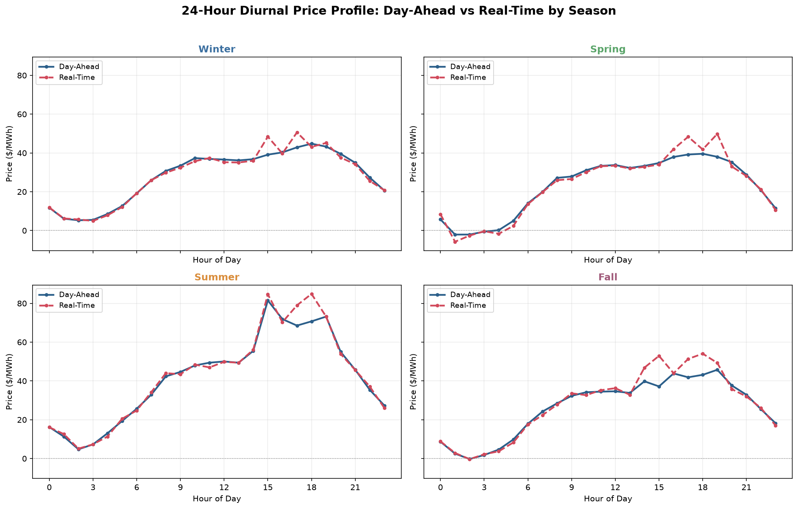
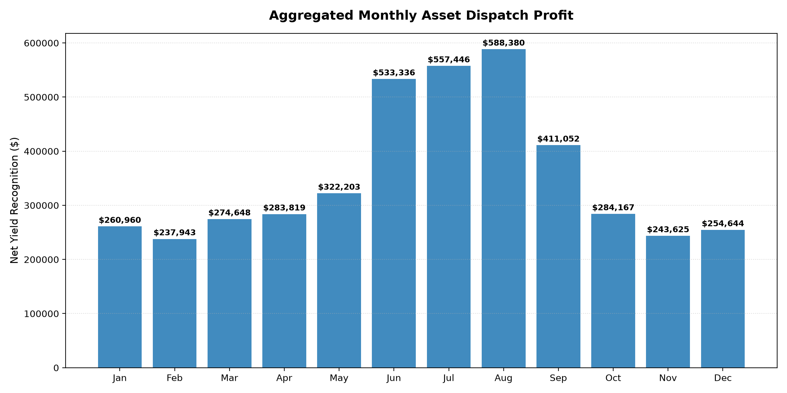
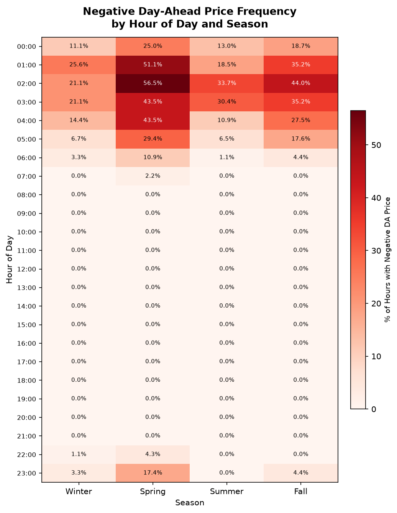

# Battery Energy Storage Arbitrage Opportunity 

## Key Takeaways and Strategic Outlook

A 100 MW, 2‑hour battery following a simple daily strategy—charging during the two lowest‑priced hours and discharging during the two highest‑priced hours—would have generated approximately **$4.25 million in gross profit** in 2025, averaging **$11,650 per day**. The strategy was profitable on every day of the year.

**Recommendation:** The market exhibits strong and consistent price spreads that justify advancing to a deeper feasibility stage. These results represent a best‑case ceiling, not a forecast, but the underlying economics are compelling.

---

## Market Dynamics: When Power Is Cheap vs. Expensive

Wholesale prices follow a clear daily pattern shaped by the relationship between Day‑Ahead and Real‑Time markets, with predictable low‑price overnight periods and high‑price evening peaks.

The daily rhythm maps directly to system load shifts:
* **Overnight (1–5 a.m.)** Prices are consistently lowest—and often negative—because demand is minimal while inflexible supply occasionally exceeds what the grid needs.
* **Midday** Prices soften as solar generation ramps and covers a large share of load.
* **Late Afternoon to Evening (3–8 p.m.)** Prices reach their highest and most volatile levels as solar output declines and demand peaks.

Seasonally, spring exhibits the most negative‑price hours due to mild weather and strong renewable output, while summer shows the highest overall prices driven by air‑conditioning demand. These daily and seasonal dynamics are the primary drivers of battery value.

In regard to monthly profit, there is a clear seasonal pattern, with stronger returns in periods of high system demand and wider price spreads, and softer performance during mild‑weather months when volatility compresses. 

---

## What Causes Negative Prices?

Negative prices occur when supply exceeds demand, typically under two conditions:
1. **Inflexible baseload units** remain online even when demand drops because they are expensive or slow to shut down and restart.
2. **Wind and solar generation** continue producing when conditions are favorable and cannot be easily curtailed due to contractual or economic structures.

In this dataset, the Day-Ahead market cleared with a total of **633 hours** of negative pricing. When these factors coincide overnight, the grid may pay assets, such as batteries, to absorb excess energy. These hours create some of the strongest arbitrage opportunities. The negative day-ahead heatmap below reinforces this pattern, visualizing where oversupply conditions occurred most commonly.

---

## Strategy Viability & Real‑World Caveats

The backtest assumes **perfect foresight** of next‑day prices. Real operators must rely on forward price forecasts, which are inherently imperfect, creating a structural upward bias in this backtest's performance. Real-world execution will be bounded lower than this theoretical maximum. Additional factors will compress real‑world returns:

* **Price cannibalization:** As more batteries enter the market and trade against the same patterns, spreads will narrow over time.
* **Grid constraints:** Interconnection limits and local transmission curtailment risk may restrict actual dispatch capacity below the idealized 100 MW threshold.
* **Operational realities:** Degradation, maintenance downtime, and minor efficiency losses reduce cumulative usable cycles over time.

In conclusion, while the $4.25M result is a theoretical best‑case ceiling, the strength and consistency of the underlying price spreads indicate that the battery arbitrage strategy would likely remain profitable even under more conservative real‑world assumptions.

---
